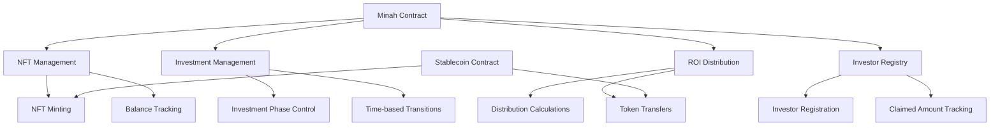
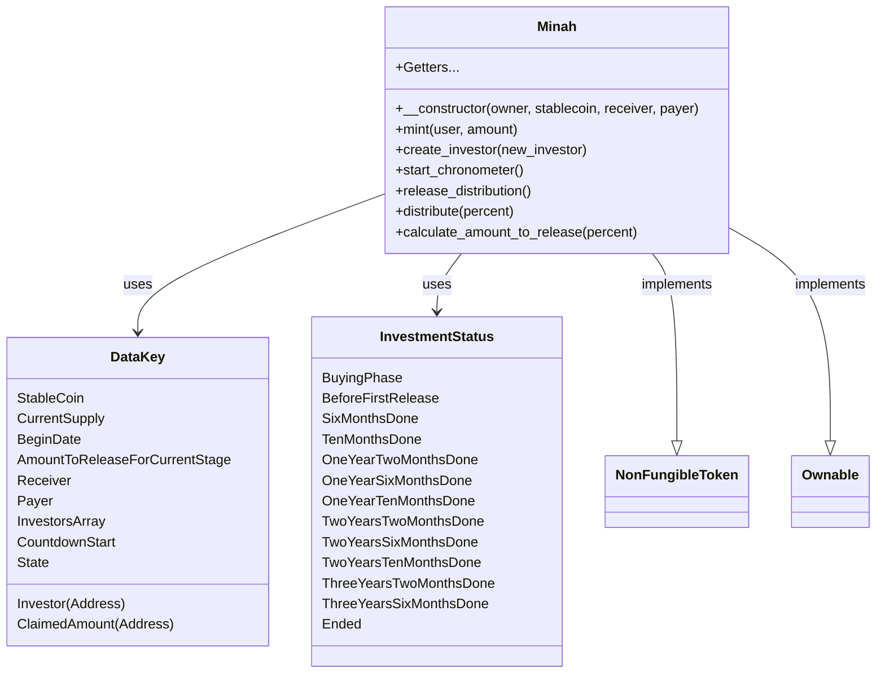
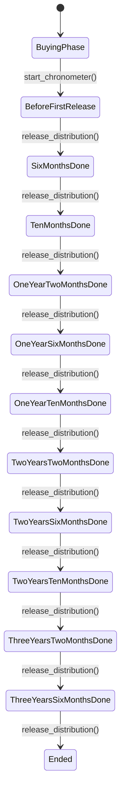
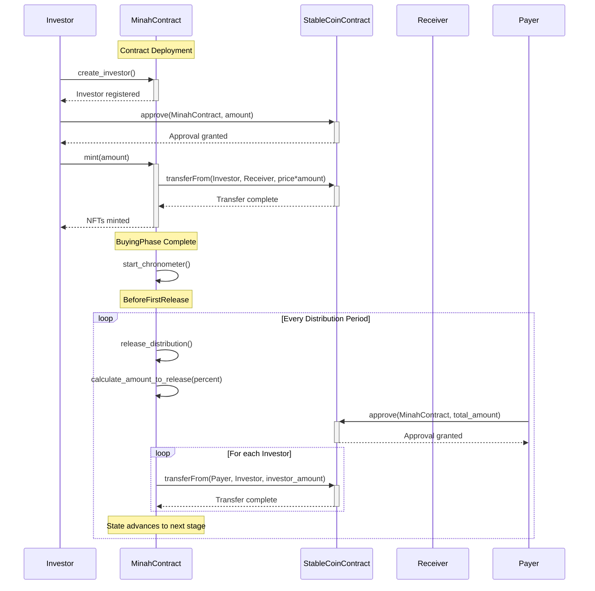
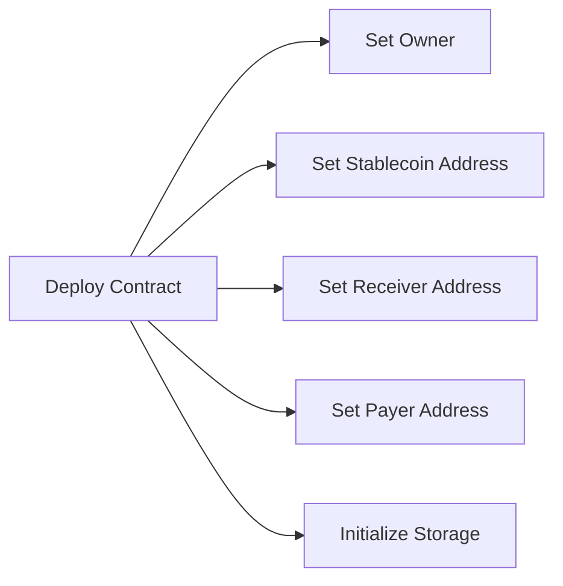
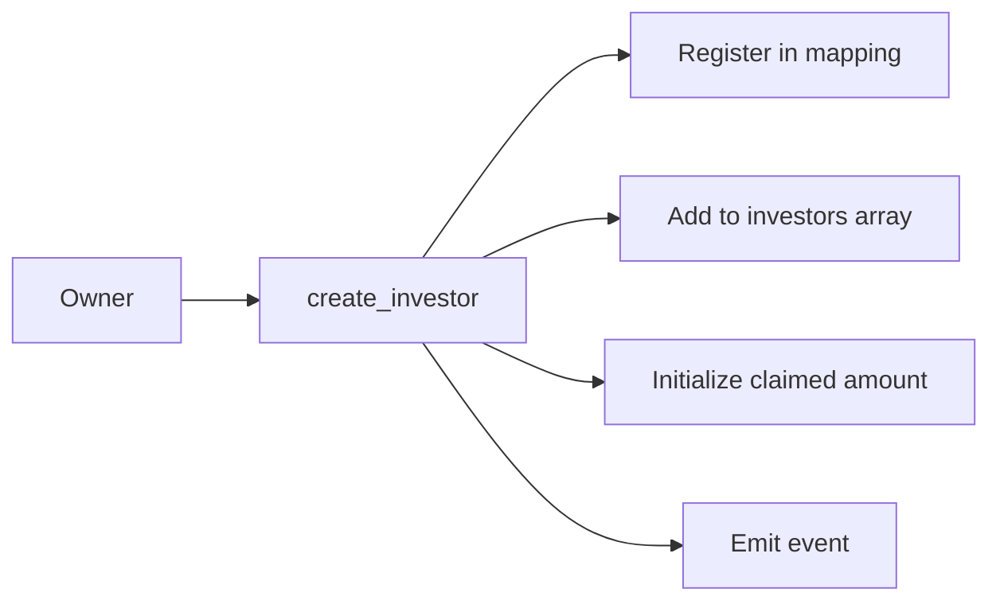
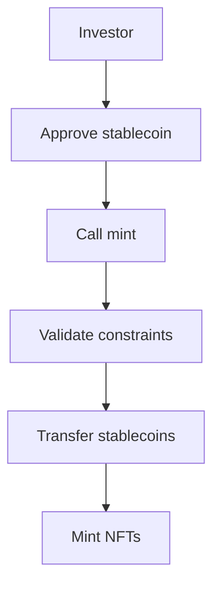
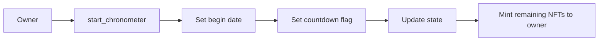
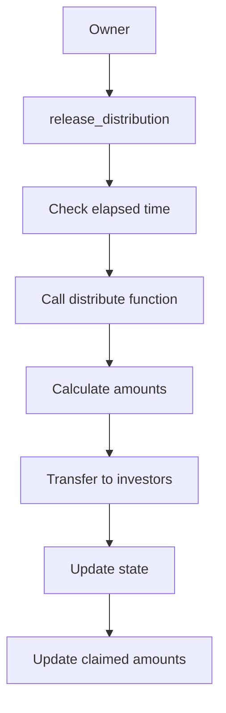

# Minah Smart Contract Architecture

This document provides an overview of the Minah smart contract architecture, which is designed to manage investment NFTs with scheduled return on investment (ROI) distributions.

## Overview

The Minah contract is a Soroban-based NFT platform that allows investors to purchase NFTs and receive ROI distributions over a 3-year period. The contract implements a structured timeline for ROI distributions at specific intervals.

## Architecture

### Core Components



### Data Model



### State Transition Flow



### Investment and Distribution Flow



## Core Constants

- `TOTAL_SUPPLY`: 200 NFTs (to be changed to 4500 for production)
- `PRICE`: 1 token per NFT (to be changed to 455 for production)
- `STABLECOIN_SCALE`: 10^6 (USDC has 6 decimals)
- `DISTRIBUTION_INTERVALS`: Time intervals for ROI distributions
- `ROI_PERCENTAGES`: Percentage of investment to be distributed at each stage

## Workflow

### 1. Contract Deployment



To deploy the contract:

```bash
stellar contract deploy \
  --wasm target/wasm32v1-none/release/minah.wasm \
  --source-account <account> \
  --network testnet \
  --alias minah_1 \
  -- \
  --owner <owner-address> \
  --stablecoin <stablecoin-contract-address> \
  --receiver <receiver-address> \
  --payer <payer-address>
```

### 2. Investor Registration



The contract owner calls `create_investor` to register a new investor. This function:
- Adds the investor to the investors mapping
- Adds the investor to the investors array
- Initializes the claimed amount for the investor to 0
- Emits an `InvestorCreated` event

### 3. NFT Purchase



For an investor to purchase NFTs:
1. The investor approves the Minah contract to spend their stablecoins
2. The investor calls the `mint` function with the desired NFT amount
3. The contract validates:
   - Minimum investment amount (≥ 40 NFTs)
   - Current phase is BuyingPhase
   - User is a registered investor
   - Total supply not exceeded
   - Maximum per-investor NFT limit not exceeded (≤ 150 NFTs)
   - Sufficient stablecoin balance and allowance
4. The contract transfers stablecoins from the investor to the receiver address
5. The contract mints the requested NFTs to the investor

### 4. Start Investment Phase



Once the buying phase is complete, the owner calls `start_chronometer` to:
- Record the current timestamp as the begin date
- Set the countdown flag to true
- Change the state to BeforeFirstRelease
- Mint any remaining NFTs to the contract owner

### 5. ROI Distribution



At the appropriate intervals, the owner calls `release_distribution` which:
1. Checks if the required time has elapsed since the begin date
2. Calls the internal `distribute` function with the appropriate percentage
3. Calculates the amount to release for each investor based on their NFT holdings
4. Transfers stablecoins from the payer to each investor
5. Updates the state to the next phase
6. Updates claimed amounts for each investor

## Building and Testing

To build the contract:

```bash
# Build all contracts
cargo build --release --workspace

# Build a single contract (minah)
cargo build -p minah --target wasm32-unknown-unknown --release

# Using the Makefile in the contract directory
cd contracts/minah
make build
```

To run tests:

```bash
# Run tests for the minah contract
cargo test -p minah
```

## Important Notes

1. The contract uses the `soroban-sdk` for building Stellar-based smart contracts.
2. It implements the `NonFungibleToken` and `Ownable` traits from the provided libraries.
3. The contract follows a strict state transition pattern for managing the investment lifecycle.
4. ROI distributions occur at predefined intervals with specific percentages.
5. The contract integrates with a stablecoin contract for handling token transfers.

## Security Considerations

- The contract includes ownership controls via the `Ownable` trait.
- Critical functions are protected with the `#[only_owner]` attribute to restrict access.
- Balance and allowance checks ensure sufficient funds before transfers.
- State checks enforce the correct sequence of operations.
- Proper authorization is required for sensitive actions via `require_auth`.